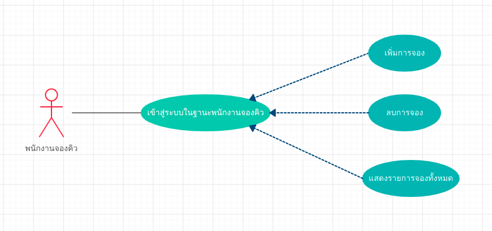
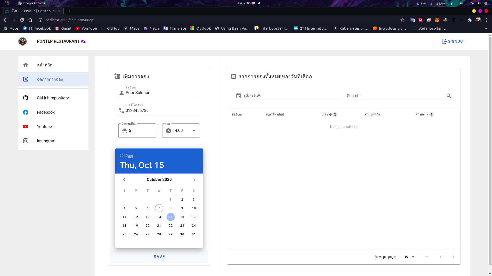
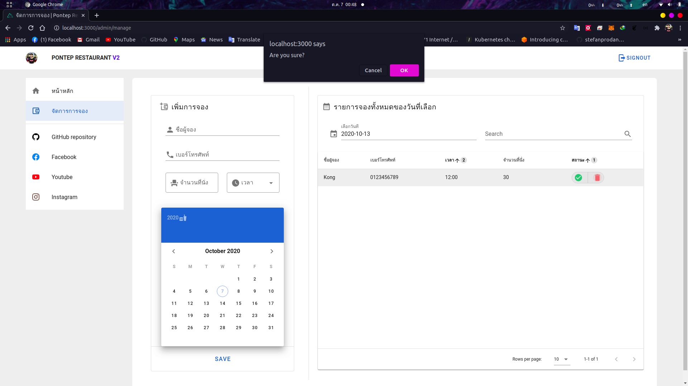
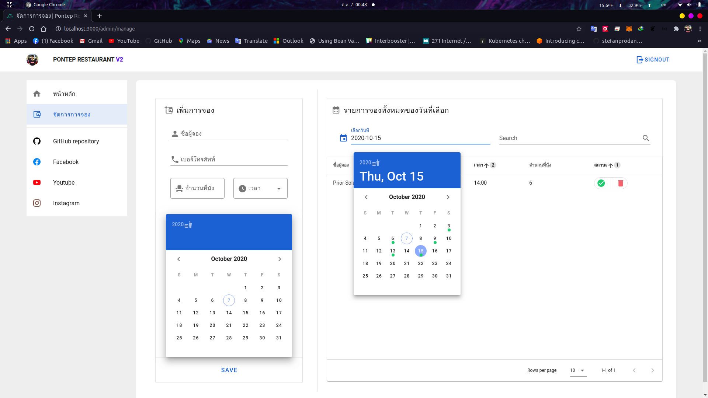

# ระบบจองร้านอาหาร  
## Dev Assignment for Prior Solution Co.,Ltd.  
- B6000783 นายพรเทพ ทวีทรัพย์
- ระบบจองร้านอาหาร มีเงื่อนไขดังนี้
  1. สามารถเพิ่มการจองได้
  2. สามารถลบการจองได้
  3. สามารถแสดงรายการจองทั้งหมด โดยแบ่งแสดงเป็น รายวัน โดยในแต่ละการจองต้องสามารถรู้ได้ว่า ใครเป็นผู้จอง จองกี่ที่นั่ง และจองเวลากี่โมง
  
## Business Use Case Diagram


## Application architechture
- Front-end: Nuxt.js (SSR)
- Back-end: Firebase/Firestore, Authentication, Functions
  
## Demo
- เพิ่มการจอง
  
- ลบการจองได้
  
- แสดงรายการจองทั้งหมด
  
- *ภาพ Demo เพิ่มเติมอยู่ในโฟลเดอร์ image/  

## Build Setup
  *services/firebase.js กรุณาติดต่อทาง Facebook messenger.
```bash
# install dependencies
$ npm install

# serve with hot reload at localhost:3000
$ npm run dev

# build for production and launch server
$ npm run build
$ npm run start

# generate static project
$ npm run generate
```

For detailed explanation on how things work, check out [Nuxt.js docs](https://nuxtjs.org).
